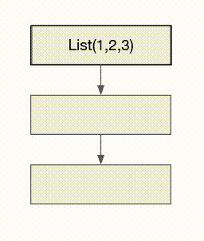
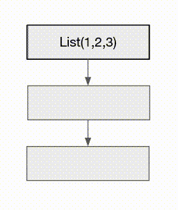

# Scala


## Why Functional Programming ?

- To make program composition easy
- To eliminate side effects.

Side effect is a function that does more than returning return value. Programs that have side effect are more buggy and difficult to test.
```$xslt
int count = 0;

String method(String s) {
   count = count + 1; // this is side effect
   return "xxx" + s;
}
```

## Scala Basics
- [Side effects](https://alvinalexander.com/scala/scala-idiom-methods-functions-no-side-effects)
- [Monad](https://medium.com/beingprofessional/understanding-functor-and-monad-with-a-bag-of-peanuts-8fa702b3f69e) 
- Operations (tutorials: [AlvinAlexander](http://allaboutscala.com/#chapter-2-learning-scala-basics), [AllAboutScala](http://allaboutscala.com/#chapter-2-learning-scala-basics))

Cheatsheet:
- Functor : anything with map
- Monad : functor with flatmap

## From Java to Scala

### Variables
- `val` : immutable, similar to Java's `final`
- `var` : mutable

val cannot be reassigned
```dtd
val x = "aaa"
x = "bbb" // error
```

Scala also has type inference that automatically detects object type
```dtd
val x : String = "aaa"
val x = "aaa" 
```

In Scala we always prefer immutability. We don't modify the reference **and** the object. Many common object types like List, Map, Set are immutable. Consider this example:

Java
```
List<Integer> source = new ArrayList<>(Arrays.asList(1, 2, 3));
for(int i = 0; i < source.size(); i++){
    source.set(i, source.get(i) * 10);
}
// source is now (10,20,30)
```
Scala
```scala
val source = List(1,2,3)
val result = source.map(p => p * 10)
// source is still (1,2,3), result is (10,20,30)
```
In Scala we create a new object when we modify an object. 
(*) Actually Java is starting to understand immutability too because `List.of(...)` in Java 9 produces immutable list. 
 
### Methods and Functions
#### Methods
Methods are defined with `def`
```scala
def display(input: Int): String = {
   "You entered:" + input
}
```
or
```scala
def display(input: Int) = "You entered:" + input 
```
- Scala does not need `return` keyword. The final line in the method is the return value
- If the method is one line, it doesn't need brackets

In Java `void` is used for method that doesn't return anything. In Scala such method is called procedure and returns `Unit`.
```scala
def procedure(i : String) : Unit = print(i)
```

Also Scala supports default value
```scala
def display(input: Int = 0) = "You entered:" + input
display() // "You entered: 0" 
```

For methods that don't have parameter we can invoke it without parenthesis
```scala
def display = println("This is a text")
display
```

#### Functions
Functions in Scala are first-class and usually declared with `val`

```scala
val display = (input: Int) =>  "You entered:" + input 
```

If you are not sure, you can always use `def`. But it is important to know that `val` is lazily evaluated (executed once on the line is declared and the result is stored for future use).
[Advanced use](https://stackoverflow.com/questions/4839537/functions-vs-methods-in-scala). 

### Collections


Declaring a collection is simple
```scala
List(1,2,3)
```
Unlike Java, Scala doesn't need `.stream` or `.collect(Collectors.toList());`
```scala
val result = List(1,2,3).map(p => p * 10)
// result is List(10,20,30)
```
In Scala `_` is wildcard 
```
val result = List(1,2,3).map(_ * 10) // same as above
val result = List(1,2,3).filter(_ != 2) // filter out 2
val result = List(1,2,3).reduce(_ + _) // equals to List(1,2,3).reduce((a,b) => a+b) 
```

Remember that default collection types are immutable. That means you cannot add or remove elements from List. 
If you want to do it you can create a new List  ([Complete Operations](http://allaboutscala.com/tutorials/chapter-6-beginner-tutorial-using-scala-immutable-collection/scala-tutorial-learn-use-immutable-list/))

```scala
val a = List(1,2,3)
val b = a :+ 4
// b is List(1,2,3,4)
```
or you can use ListBuffer
```scala
import scala.collection.mutable.ListBuffer
val a = ListBuffer(1,2,3)
a.append(4)
// or
a += 4
// a is ListBuffer(1,2,3,4)
```

Other useful methods:
- zip
```scala
val a = List(1,2,3)
val b = List("a", "b", "c")
val c = a.zip(b)
// List((1,a), (2,b), (3,c))
```
Sometimes we don't need to write `.` so it can be as simple as
```
val c = a zip b
```
- reverse

Reversing "abc" to "cba" is a popular interview question
```scala
"abc"
.toList // "abc" to List("a", "b", "c")
.reverse // List("a", "b", "c") to List("c", "b", "a")
.mkString("") // List("c", "b", "a") to "cba"  
```


#### Tuple
Scala supports literal tuples. To access the members, we use `._index`
```scala
val a = 10
val b = "aaa"
val c = (a , b)
println(c._1) // 10
println(c._2) // "aaa"
```

#### Map
Map can be expressed as literal with `->` to pair key and value
```scala
val map = Map((1 ->"one"), (2 -> "two"), (3 -> "three")) 
map(2) // "two"
```
Map is also immutable so to add new element, we have to create a new Map
```scala
val map = Map((1 ->"one"), (2 -> "two"), (3 -> "three")) 
val map2 = map + (4 -> "four")
```
Also in Scala it's easy to convert List of tuples to Map

```scala
List( (1, "one"), (2, "two"), (3, "three") ).toMap
// now it's Map((1 ->"one"), (2 -> "two"), (3 -> "three")) 
```
We can also apply other function before conversion to Map
```scala
List( (1, "one"), (2, "two"), (3, "three") )
.map(p => (p._1 * 10, p._2))
.toMap
// now it's Map((10 ->"one"), (20 -> "two"), (30 -> "three"))
```
To change Map to List of tuples we simply use `toList`
```scala
Map((1 ->"one"), (2 -> "two"), (3 -> "three")).toList
// now it's List( (1, "one"), (2, "two"), (3, "three") )
```

### Generics
In Scala generics is expressed with `[]` (In Java it's `<>`).
For example
```scala
val list : List[Int] = List(1,2,3)
```
### Object and Class
In Scala object is singleton. An object is usually the entry point to a program (like Java's main method).
To call any method in an object we don't need to instantiate the object. In Java this is similar to `public static` modifier. 

Example:
```scala
object SingletonObject {
  def greet = println("Hello")
}

SingletonObject.greet

```

Class is like a Java class and can be instantiated many times. 

Example:
```scala
class Person(val firstName: String, val lastName: String) {
  val fullName = firstName + " " + lastName

  printFullName

  def printFullName = println(fullName) 
}

new Person("Martin", "Utama")
// Martin Utama
```
In Scala class, the entire body is a constructor. In the class above, println will be called upon instantiation as it is part of constructor.


### Companion object
Companion object is an object that is put next to class with a same name in a same file.
- Object and class in companion object structure can access each other's fields. 
- Class ideally contains data.
- Object ideally contains business logic.  

(*) The concept of companion object has been introduced in Kotlin

#### apply
The first use of companion object is to provide factory pattern for the class. In Scala we use `apply` as factory to create a class instance. 
```scala
class Person(val firstName: String, val lastName: String){}
```
When we use `apply`, we don't have to use `new` when instantiating the class. 
```dtd
val martin = Person("Martin", "Utama")
```

One good application of `apply` is to build a configuration object.
```
abstract class DatabaseDriver {
  // database
}

object DatabaseDriver {
  def apply(config: Configuration) = config.dbType match {
    case "MYSQL" => new MySqlDriver()
    case "PSQL" => new PostgresDriver()
    case _ => new GenericDriver()
  }
}

val mydatabase = DatabaseDriver(dbConfig)
```

#### unapply
`unapply` is an extractor method. It extracts the values of an object during pattern matching.

```scala
class Person(val firstName: String, val lastName: String){}

object Person{
  def apply(firstName: String, lastName: String ): Person = new Person(firstName, lastName)

  def unapply(arg: Person): Option[(String, String)] = Some(arg.firstName, arg.lastName)
}
```
Later we can use it like this
```dtd
def patternMatch(x: Any) = x match {
  case Person(lastName, firstName) => println(s"Hello $firstName $lastName")
  case _ => println("Hello Stranger")
}

patternMatch(Person("Martin", "Utama"))
// Hello Martin Utama
```
Basically pattern matching allows us to match an object against a type and extract its values. We will discuss more about it later.


#### Case class
`case class` is a regular class but has `apply`, `unapply`, `copy` (for cloning), etc already generated by Scala. We just need to define the data.

```scala
case class User(name: String, id: Int)
```
In Java it would be equal to 
```java
class User {
  public final String name;
  public final Integer id;

  public User(String name, Integer id){
    this.name = name;
    this.id = id;
  }
}
```
Since `case class` already has `apply` we can instantiate it without `new` keyword.  
```dtd
val user = User("Martin", 13)
```

### String literal
In Scala we can write a text without escaping characters. We do it with three double quotes `"""  """`
```scala
val x = """ Single quotes ', double quotes "" are ok """
// Single quotes ', double quotes "" are ok
```
We can also handle lines easily with `|`
```scala
val x ="""This is 
       |a multiline
       |String""".stripMargin
```
`stripMargin` basically strips any identation or left margin so the text will look clean. 
We can also insert values in text easily by prepending String with `s`
```
val name = "Martin"
val x = s"Hi my name is $name"
```
We can also insert expression
```scala
val i = 3
val x = s"${i - 1}"
// 2
```

### Pattern matching
Scala pattern matching is like Java switch-case but more powerful. 
The standard syntax is simple:
```dtd
val x: Int = Random.nextInt(10)
x match {
  case 0 => "zero"
  case 1 => "one"
  case 2 => "two"
  case _ => "other"
}
```
We can also match a value against type (similar to Java's `instanceof`).
```dtd
c match {
  case s: String => 
  case i: Int =>
  case _ => // this is default
}
```
But we can also do type matching and extract its values (refer to `unapply` above). 
```dtd
abstract class Notification
case class Email(sender: String, title: String) extends Notification
case class SMS(caller: String, message: String) extends Notification

def showNotification(notification: Notification): String = 
  notification match {
    case Email(sender, title) => print(s"$sender $title")
    case SMS(number, "hi") => print("hi") // match SMS with "hi" message
    case SMS(number, _) => print(number) // match SMS with any message
}
```
There are other useful pattern matching scenarios. For example matching a List against a sequence pattern
```dtd
case List(0, _, _) => // List(0,2,45) will match
                      // but List(1,2,3) will not match

case List(10, _*) => // List(10,2,3,45,4,56) or List(10) will match
                     // but List(0,1) will not match 
```

Read more about pattern matching's use cases [here](https://alvinalexander.com/scala/how-to-use-pattern-matching-scala-match-case-expressions).

### Null handling 
In Scala we always avoid writing or reading null. We use Option for any value that *may* be null (i.e JSON parsing or database query).
 
 Scala Option has two subclasses: None and Some. 
The rule is:
- `Option(null) is None`
- `Option(100) is Some(100)` 

Scala Option is similar to Java's Optional. We can assign a default value or check if it's defined.
```dtd
Option( ... ).getOrElse( defaultValue )
Option.isDefined
Option.isEmpty
```
We can also get the value functionally with `map` or `foreach`
```dtd
Option( 1 ).map(p => p * 10)  // map will run
Option( null ).map(p => p * 10) // map will not run
```

### Try
In Scala Try wraps a computation that may return an exception. Declaring it is very simple
```dtd
Try( ... )
``` 
We handle the result with Success and Failure
```dtd
val t =  Try ( 1 / 0 )
t match {
  case Success(value) =>  
  case Failure(exception) => 
}
```
In the example above, the result will appear in `Failure(exception)` because of division by zero.

Like Option, we can provide Try with a default value with `getOrElse`
```dtd
Try ( 1 / 0 ) getOrElse(999)
// 999
```
We can also use `recover` which returns a Try. Usually we do it to defer the execution. 
```dtd
Try ( 1 / 0 ) recover {case exception => 999}
// Success(999)
```
The properties of Try are shared with `Future`, to be discussed later.

## Concurrency
In general concurrency task can be divided into four regions:

|              | Single        | Multiple  |
| ------------ |:-------------:| :-----:|
| Synchronous  | A                    | Iterable[A] |
| Asynchronous | Future[A] or Task[A] |   Observable[A] |

(*) A is `Any`, equivalent to Java `Object`

- Synchronous & single value: the basic programming style
- Synchronous & multiple values: 
    - Use Case : Iterating List or array
    - Tools: Java 8 Streams API
- Asynchronous & single value
    - Use Case: Passing requests in web server
    - Tools: JS Promise, Java and Scala Future, or Scala Task 
- Asynchronous & multiple values
    - Use Case: Iterating data from a very big file or an infinite list (streams) and sending them to database
    - Tools: Reactive Streams (RxJava) 
     
### Scala Future

Scala Future is simple
```$xslt
Future{ ... }
```
To resolve it we use higher-order functions like map or foreach
```$xslt
Future{ 1 }. map(p => ...) // 1 will arrive in p
```

Or we can resolve it like this
```$xslt

Future{ 1/0 }.onComplete {
  case Success(p) => 
  case Failure(e) => 
}

``` 
And we can compose it with for-comprehension
```$xslt
val composition = for {
  f1 <- Future{ 3 }
  f2 <- Future{ f1 + 50 }
  f3 <- Future { f2 + f1 } // any Future can get the results from previous Futures, in this case f1 and f2
yield (f2, f3) // yield returns the value
composition.map(p => ...) // what is p ?
```
Remember that Future shares the same property with `Try` so we can provide a default value in case any process throws an exception. 
One example is a web server. Web server needs to read a request parameter and return a page. If the parameter is invalid we can return a default page, usually a front page. 
```$xslt
val pageNumber = "sdfgdf"
val composition = for {
  fPageNumber <- Future { pageNumber.toInt } recover {case e => 0}
  fPageObject <- Future { getFromDb( fPageNumber )}
} yield fPageObject
composition.map(p => request.send(p)) 
```
The composition above will try to parse a page number. If it fails it will assign zero or landing page to be retrieved from database.

### The problem with Scala's default Future

Short answer: It is eagerly evaluated.

Long answer: It breaks [referential transparency](https://nrinaudo.github.io/scala-best-practices/definitions/referential_transparency.html). 

Referential transparency means that any expression can be replaced by its value.
Consider this code:
```$xslt
val f = Future {
  println("Hello")
  67
}

val composition = for {
  f1 <- f
  f2 <- f
} yield (f1, f2)

composition.foreach(println)
/*
Hello
(67,67)
*/
```
We have a Future that contains a print "Hello" and return value 67. We assign it to `f`. Then we use `f` twice in a future comprehension. 
By intuition we should see "Hello" twice. But it is only printed once. 
This happens because Future is resolved by the time it is declared in the variable and the result is memoized. 
So `f` is not equivalent to the Future but the result of the Future. That's why it breaks the referential transparency. 
For this reason we are going to use other libraries like Monix or ZIO which has good mapping between Future and Task (basically you can replace "Future" with "Task" in the code and it will still be okay).

### Observable

Monix Observable is functional implementation of ReactiveX. In Java the library is known as RxJava. 

Observable evaluates an element in a collection to the end of the process before moving to the next element. 

### Difference between Future/Task and Observable

Future/Task evaluates the content as a single value. 
Observable evaluates the content one-by-one. 

Let's say we want to pass List(1,2,3) into two tasks where each time we apply multiplication by ten. This is how they work:
 
Future/Task



Observable



The codes:
```
// Task
val comp = for {
  f1 <- Task( List(1,2,3))
  f2 <- Task( f1.map(_ * 10))
  f3 <- Task( f2.map(_ * 10))
} yield f3
comp foreach println

// Observable
Observable.fromIterable(1 to 3)
  .mapEval(p => Task(p * 10))
  .mapEval(p => Task(p * 10))
  .foreachL(println)
```

#### Observable Basics
- Observable composition starts with a data source. The data source is usually stream or infinite list. 
- An Observable needs a Subscriber to run. Monix provides built-in Subscribers with operators whose name end in "L" (i.e `foreachL`, `completedL`, `foldLeftL`)
- Observable supports backpressure to process several elements in batch. In the default setting each element is processed one-by-one before moving to the next. 

### Multi-threading and thread pools
Read this [first](https://gist.github.com/djspiewak/46b543800958cf61af6efa8e072bfd5c). 

Threads are expensive and not infinite. They come from thread pool which requires allocation.
In most cases we define an ExecutorService but in cases where it is not explicitly needed Java will use a thread pool based on ForkJoinPool. (Read about [it and its work stealing algorithm](https://www.baeldung.com/java-fork-join))  
Thread pool should be configured depending on the purposes. In general there are only three types:
- CPU-bound  (i.e computation, image processing, file read)
- Non-blocking IO (i.e web socket communication)
- Blocking IO (i.e database query using JDBC)

CPU-bound needs a fixed pool with number of threads equivalent to number of CPUs. We can also use ForkJoinPool here. 
Non-blocking IO can use a single thread. 
The problem  is non-blocking IO. The best way to handle it is replacing blocking library with a non-blocking one (in case of JDBC, [this](https://github.com/jasync-sql/jasync-sql) is the non-blocking alternative).